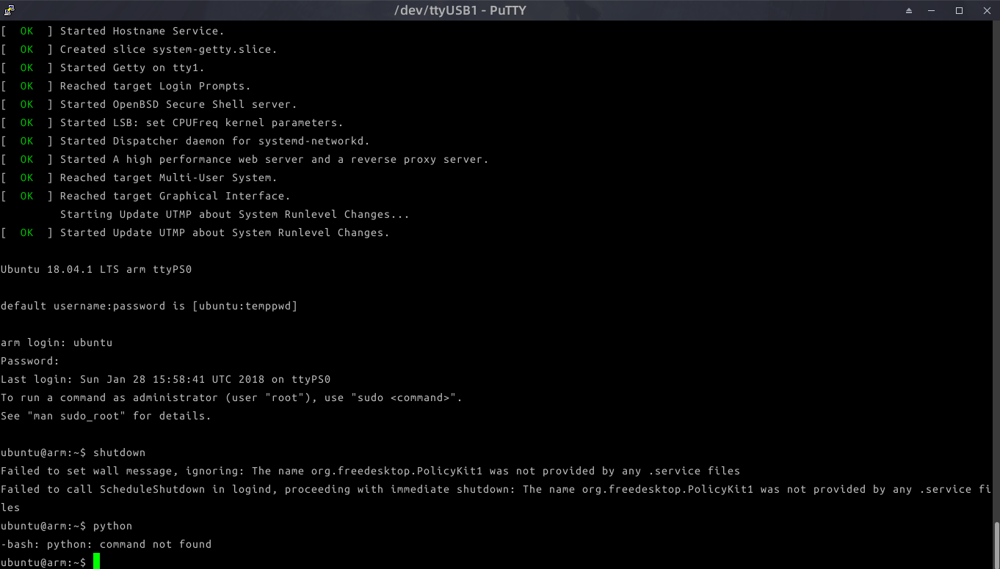

# Xilinx-ARM-Linux-ZYNQ

#### 介绍
Xilinx公司的base system 硬件平台生成的，基于arm架构重新编译的linux板载操作系统

#### 软件架构
软件架构说明

BOOT启动分区：BOOT.bin,UIamge,devicetree.dtb
FS文件系统：Ubuntu18.04 LTS minimal rootfs

BOOT.bin文件用于启动zybo板时加载引导程序，由板载引导加载UBOOT启动linux
uImage文件为linux系统内核文件，用于启动系统挂载磁盘
devicetree.dtb文件为设备树二进制文件，用于加载硬件设备

#### 安装教程

1. 使用分区工具对sd卡进行分区，分成BOOT区（fat32格式），FS区（EXT4格式）
2. 将BOOT.bin,uImage,devicetree.dtb文件放入系统的BOOT分区
3. 使用linux系统的同步命令rysnc 把文件系统所有文件同步到FS分区内

#### 使用说明

1. 把sd卡插入zybo板卡槽，将跳线帽J3放置到SD位，使用SD卡启动
2. 连接供电，使用putty或者其他串口调试工具连接zybo板，默认波特率115200
3. 按下zybo板的重启按钮，开始载入系统，在putty上观察输出

#### 成果

#### 参与贡献

1. Fork 本仓库
2. 新建 Feat_xxx 分支
3. 提交代码
4. 新建 Pull Request

#### 注意事项

1. 若要自己编译uboot.elf文件，需要修改zynq.h文件，去掉有关ramdisk启动的语句，因为需要sd卡启动
2. 使用xilinx官方提供的linux内核编译
3. 下载最新的xilinx官方提供的base-system系统使用vivado进行板材更新，使用sdk工具生成启动镜像文件，vivado版本低于2017.4可能出现工程不能更新的问题
4. 跳线帽一定要放在sd启动位，否则不能从sd卡启动
5. 使用linaro官方提供的ubuntu arm编译系统可能会出现内核不能挂载文件系统的问题，因为文件系统过于old
6. [我的博客](https://landers1037.top)

